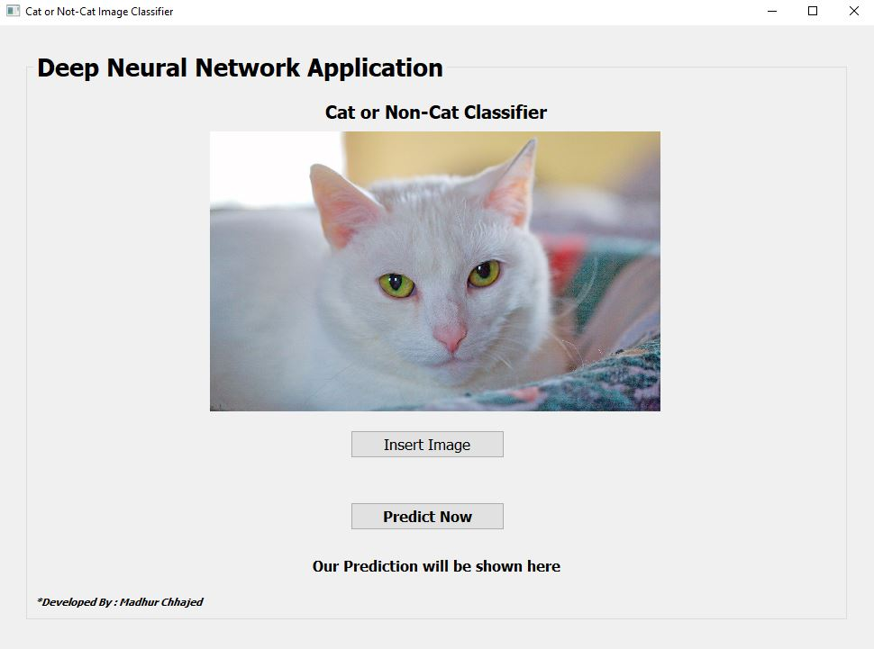
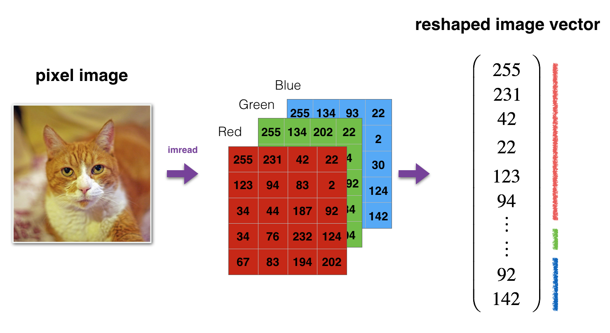

# Cat-or-Not-Cat-Image-Classifier
A deep neural network application for classification of images as a cat or not cat.

## Content :
1. How our application works ?
2. How our neural network model works ?

# How application work ?
After downloading are project you can directly run main.py file.

### On App start : there are two function available which need to be followed in order. 
        1. Insert Image : You can browse your image or choose from images folder in this project.
        2. Predict Image : Once you can see your selected image you can click on Predict button which will run our predict function on your image and output the result below your image.
    
### Here our some screenshots :

  

  
  
  
  
  
    

# How our neural network model works ?

### 1. Images from our training and testing dataset are reshaped. 
 

  
  
  

### 2. Architecture of our model : 

  
  
  

### 3. Structure of our model :
#### Main stages involved in this process :
        1. Initialize parameters
        2. Forward Propogation
        3. Cost Calculation
        4. Backward Propogation 
        5. Update Parameters
        6. Predict function 

All functions required for this are defined in dnn_app_utils_v3.py file.

  
  
  

